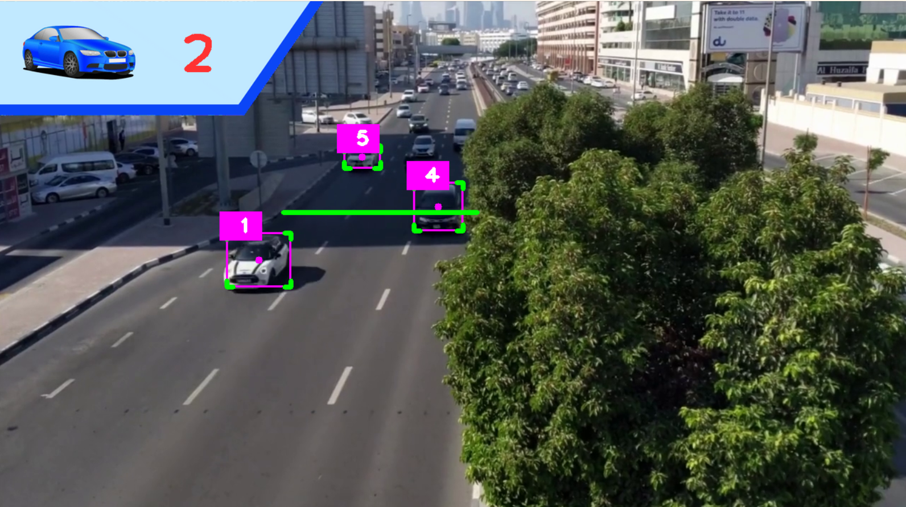
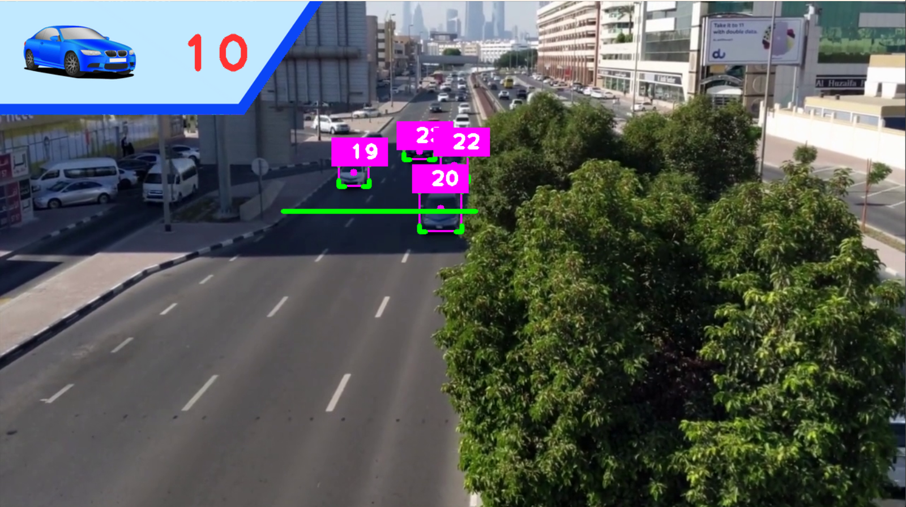

# YOLO-based Car Counter Project

## Overview

This project utilizes the YOLO (You Only Look Once) object detection model to count the number of cars in a video stream. It employs computer vision techniques to identify and track cars within a predefined region of interest (ROI) while visualizing the count in real-time.

## Key Features

- **Object Detection:** The project uses the YOLO object detection model to identify various objects in the video stream, including cars, trucks, buses, and motorbikes.

- **Real-time Counting:** It counts the number of cars within a specified region of interest (ROI) in real-time as they move through the frame.

- **Object Tracking:** The Sort (Simple Online and Realtime Tracking) algorithm is implemented to track the identified objects across video frames, associating each object with a unique ID.

- **Confidence Filtering:** Detected objects are filtered based on their confidence scores, ensuring that only objects with high confidence levels are counted.

- **Visualization:** The project provides visual feedback by drawing bounding boxes around detected objects and displaying the count of cars in real-time on the video stream.

## How it Works

**Initialization:**

- The YOLO object detection model is loaded with pre-trained weights.
- A region of interest (ROI) is defined within the video frame to focus on the area where car counting will take place.
- The Sort tracker is initialized with parameters such as the maximum age, minimum hits, and IOU (Intersection over Union) threshold.

**Object Detection:**

- The video frames are continuously captured.
- The project uses a mask to isolate the ROI within each frame.
- The YOLO model is applied to the ROI to detect objects, and their coordinates and confidence scores are extracted.
- Detected objects that are cars, trucks, buses, or motorbikes with confidence scores above a threshold are considered.

**Object Tracking:**

- The Sort tracker is used to track the detected objects across frames, associating each object with a unique ID.
- The tracker updates the object positions and IDs in each frame.

**Counting and Visualization:**

- The project draws bounding boxes around the detected and tracked objects, providing visual feedback.
- The count of cars within the specified ROI is displayed in real-time on the video stream.
- When a tracked object crosses a defined counting line in the ROI, it is counted, and the count is incremented.

**Output:**

- The video stream with visualizations is displayed in real-time.
- The total count of cars is continuously updated and displayed on the video.

**Screenshots of output:**

